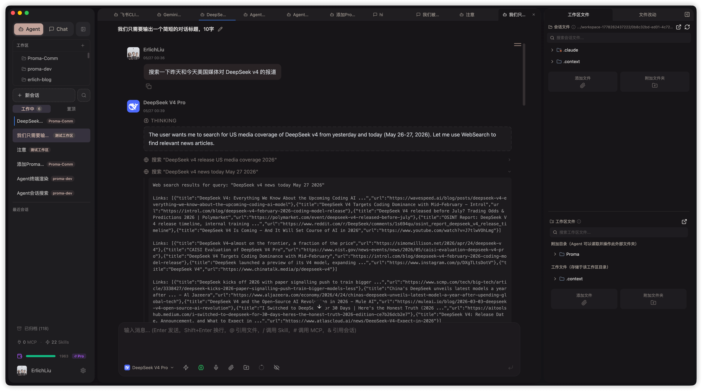
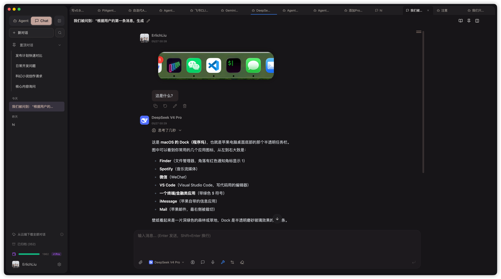

# deepseek-vision

**Vision, web search, and OpenAI-compatible proxy for DeepSeek models.**

[中文文档](./README.md)

DeepSeek's API is text-only, which severely limits Agent capabilities and user experience — especially in tools like Claude Code where web search and fetch are essential. This proxy fills all the gaps.

This project is a side open-source project from [Proma](https://proma.cool) — the smoothest general-purpose open Agent, with the most complete DeepSeek v4 support including vision and web search built in. This repo provides a self-hostable proxy version so you can plug a single DeepSeek API key into any Claude- or GPT-4-compatible tool.

---

## Quick start

### Config UI (recommended)

Start the proxy and open `http://localhost:8000`. Fill in your API keys in the config dashboard and click "Apply & Restart".

```bash
docker build -t deepseek-vision .
docker run -p 8000:8000 deepseek-vision
```

### Manual

```bash
cp .env.example .env
# Edit .env: at minimum set ADMIN_PASSWORD, MASTER_API_KEY, DEEPSEEK_API_KEY
docker run --env-file .env -p 8000:8000 deepseek-vision
```

---

## Screenshots

<table>
  <tr>
    <td align="center"><b>Login</b></td>
    <td align="center"><b>Dashboard</b></td>
  </tr>
  <tr>
    <td></td>
    <td></td>
  </tr>
</table>

---

## Endpoints

| Method | Path | Description |
|--------|------|-------------|
| `POST` | `/v1/messages` | Anthropic Messages API |
| `POST` | `/v1/messages/count_tokens` | Token counting |
| `POST` | `/v1/chat/completions` | OpenAI Chat Completions API |
| `GET`  | `/v1/models` | List available models |
| `GET`  | `/health` | Liveness check |
| `GET`  | `/` | Config dashboard UI |

All API endpoints require `x-api-key` (Anthropic style) or `Authorization: Bearer <key>` (OpenAI style).

---

## Vision

Default vision model is Qwen (`qwen3.6-flash` via Alibaba Cloud DashScope). Just set `VISION_API_KEY` to enable:

```env
VISION_API_KEY=sk-your-dashscope-key
```

Every `image` content block is replaced with `[Image N] <description>`. Multiple images are processed in parallel.

To use a different vision backend:

```env
VISION_BASE_URL=https://api.openai.com/v1
VISION_API_KEY=sk-...
VISION_MODEL=gpt-4o-mini
```

---

## Web search & web fetch

Use the Anthropic tool protocol to add `web_search` or `web_fetch` to your request. The proxy intercepts the calls, executes the search/fetch, and injects results back into context.

Configure Tavily (recommended) or Brave:

```env
TAVILY_API_KEY=tvly-...
```

---

## Configuration

| Variable | Default | Description |
|----------|---------|-------------|
| `ADMIN_PASSWORD` | `123456` | Config dashboard password — **change this** |
| `MASTER_API_KEY` | required | API key(s) accepted by this proxy (comma-separated) |
| `DEEPSEEK_API_KEY` | required | DeepSeek API key |
| `DEEPSEEK_BASE_URL` | `https://api.deepseek.com/anthropic` | DeepSeek upstream endpoint |
| `DEEPSEEK_MODELS` | `deepseek-v4-pro,deepseek-v4-flash` | Models to expose |
| `VISION_BASE_URL` | `https://dashscope.aliyuncs.com/compatible-mode/v1` | Vision model endpoint |
| `VISION_API_KEY` | — | Vision model API key (unset = vision disabled) |
| `VISION_MODEL` | `qwen3.6-flash` | Vision model name |
| `VISION_MAX_IMAGES` | `5` | Max images processed per request |
| `WEB_SEARCH_PROVIDER` | `tavily` | Search provider (`tavily` or `brave`) |
| `TAVILY_API_KEY` | — | Tavily API key |
| `BRAVE_API_KEY` | — | Brave Search API key |
| `PORT` | `8000` | Server port |
| `LOG_LEVEL` | `INFO` | Log level |

---

## Roadmap

- [ ] `/v1/embeddings` endpoint
- [ ] SearXNG search provider (self-hosted)
- [ ] Streaming tool calls in OpenAI compat mode

---

## License

MIT
